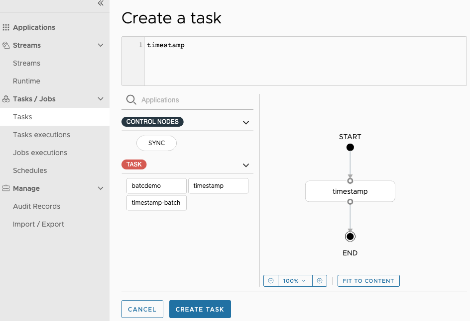
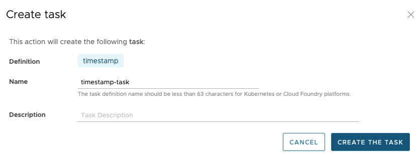

# Getting Started with Task Processing

In this guide, we create a simple task definition and launch the task.

The starting point is to use the [Spring Cloud Task App Starters](https://cloud.spring.io/spring-cloud-task-app-starters/), which provide a set of task applications.
Specifically, we use the provided `timestamp` application, which is basically a hello-world-style application that logs the current timestamp. For this guide, we assume that the respective `timestamp` task application has already been imported and registered with Spring Cloud Data Flow, as described in the [Installation guide](%currentPath%/installation/).

## Creating the Task

To create a task:

1.  In the menu, click **Tasks**.

1.  Click the **CREATE TASK** button.

    

1.  In the text area, type `timestamp`. This creates a simple task definition that uses the Timestamp task application. The following image shows the Timestamp application:

    

    Alternatively, you could have also dragged the Timestamp application from the apps palette on the left to the Flo canvas and connected `START` and `END` with the task application.

1.  Click `Create Task`.

1.  Enter `timestamp-task` as the name, as follows:

    

1.  Click the `CREATE THE TASK` button.

    The Task Definitions page appears and lists the created definition (`timestamp-task`), as follows:

    

## Running the Task

Now that you have created a task definition, you can run it. To do so:

1. Click the drop down control on the `timestamp-task` definition row and click the **Launch** option, as follows:

   

   The UI lets you provide additional:

   - **Properties**: Additional properties meant for a `TaskLauncher`.
   - **Arguments**: Any properties that need to be passed as command-line arguments.

   

1. As we do not need to provide additional argument or parameters, click the **LAUNCH THE TASK** button. The UI returns to the task definitions page, as follows:

   

After a few moments, the task definition should show a status of "COMPLETE". You may need to press the **REFRESH** button to see the updated status.

## Verifying the Output

To verify that the output is what you expect:

1. Click on the **Task executions** tab, as follows:

   

   You can see your task application with an exit code of `0`, indicating a successful execution.

1. Click on the `Execution ID` on the row to see even more details, as follows:

   

If you would also like to see the timestamp log, click the **VIEW LOG** button on the bottom of the page:

