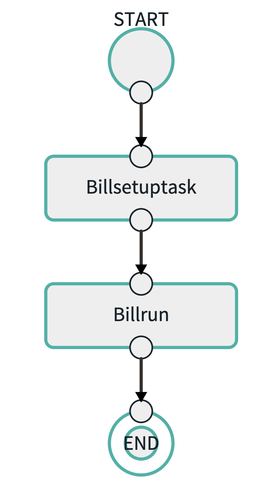
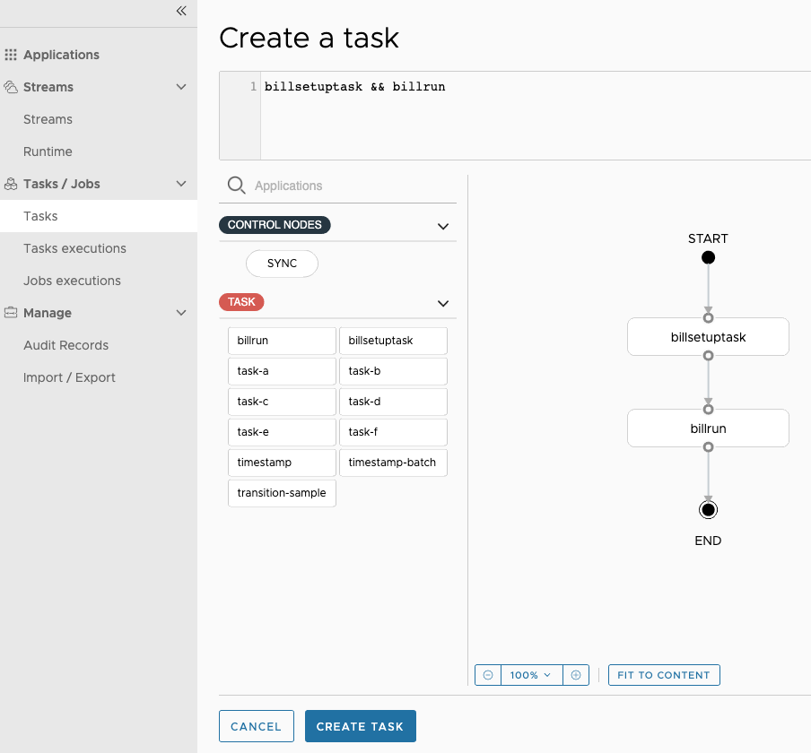
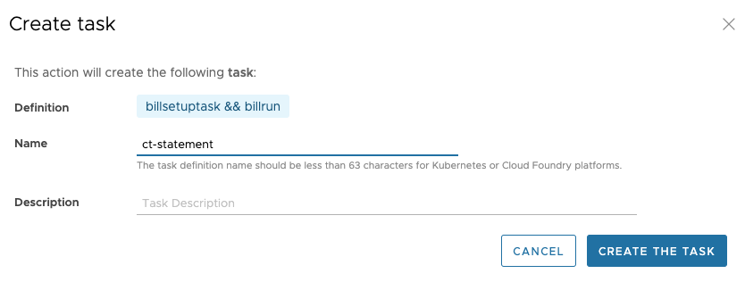

# Create and launch a Composed Task using Data Flow

In our previous sections we used two applications:

- billsetuptask: The billsetuptask setups up the database for the billrun application.
- billrun: The billrun reads usage information from a file and generates a billing statement record for each entry from a usage file.

Previously we executed the billsetuptask app and then the billrun app in sequence manually.
This certainly works for the small case where we want to run 2 apps back to back where the first app runs in a few seconds.
But what about the cases where there are 5, 10, 20 or even more apps that need to be run in a sequence and the runtime of some the apps maybe hours.  
Or cases where one of the apps returns a non zero exit code. What do we do in this case?
Spring Cloud Data Flow provides a solution for this issue through the use of Composed Tasks.  
A composed task is a directed graph where each node of the graph is a task application.
To use the case above a graph would look something like this:

In this section we show how to create a composed task using Spring Cloud Data Flow's UI, and then launch the composed task to Cloud Foundry, Kubernetes and your local machine.

## Prerequisites

### Data Flow Installation

Make sure you have installed Spring Cloud Data Flow to the platform of your choice:

- [Local](%currentPath%/installation/local/)
- [Cloud Foundry](%currentPath%/installation/cloudfoundry)
- [Kubernetes](%currentPath%/installation/kubernetes/)

### Register the Billing Applications

For this guide, we will need for you to have registered the [billsetuptask](%currentPath%/batch-developer-guides/batch/data-flow-simple-task) and the [billrun](%currentPath%/batch-developer-guides/batch/data-flow-spring-batch) applications in Spring Cloud Data Flow.

### Register the Composed Task Runner

If you haven't already done so import the [Spring Cloud Task App Starters](https://cloud.spring.io/spring-cloud-task-app-starters/), which will give us the `composed-task-runner` application.
To do this, select `Apps` from the left navigation bar, then select `Add Applications(s)`.
When the `Add Application(s)` page appears select **Bulk import application coordinates from an HTTP URI location**.
In the URI field enter either (based on the resource from which you will be pulling your apps):

- maven: `%task-app-maven-version%`
- docker: `%task-app-docker-version%`

Select `Import the application(s)`.

## Creating a Composed Task

Select `Tasks` from the left navigation bar, then select `Create task(s)`.

This displays a graphical editor that we can use to compose tasks.
The initial canvas contains `START` and `END` nodes. To the left of the canvas, we see the available task applications, including `billsetuptask` and `billrun` apps.
Drag the `billsetuptask` app to the canvas and connect the START node to the `billsetuptask`. Now drag that `billrun` application to the canvas. Connect `billsetuptask` to the `billrun` and the `billrun` to the END node to complete the composed task definition.
In this case, the composed task definition consists of a two task apps (billsetuptask and billrun).
If there are app defined configuration properties, we would set them here.

Click on `Create Task`.
This will prompt you to name the task definition, which is the logical name for the runtime configuration we will to deploy.
In this case, we will use the same name as the task application which is `ct-statement`.

Press `Create the task`.
This will display the main `Tasks` view.

<!--TIP-->

**TIP:** To see all the things that can be done with the Composed Task Graph take a look at the Composed Task [section](https://docs.spring.io/spring-cloud-dataflow/docs/current/reference/htmlsingle/#_composed_tasks_dsl) of the reference documentation.

<!--END_TIP-->

### Launch the Task

We see that three task definitions were created when we created the ct-statement.

- ct-statement: This definition represents the composed task runner that will execute the tasks in the composed task graph.
- ct-statement-billsetuptask: This definition represents the billsetuptask app that will be executed.
- ct-statement-billrun: This definition represents the billrun app that will be executed.

Now we will launch the ct-statement by pressing the `play` button (that's the middle icon that looks like an arrow head pointing right).
This will take you to a form where you can add command line arguments and deployment parameters, but we don't need any for this composed task.
Press `Launch the task` and stand back!

This will run the Composed Task Runner on the Data Flow server's task platform that will manage the execution of the composed task graph.

### Verify the results

When the execution is complete, the status for each of the task definitions will turn to a satisfying green color and show `Complete.`
Select the `Executions` tab to view a summary of executions for this task.

### Deleting a composed task

As shown before a composed task creates a definition for each app that is in the graph.
To delete all the definitions that were created as a part of the composed task we will delete the composed task runner definition.
To do that we will select the checkbox next to the ct-statement definition, then press the actions button at the upper left hand corner and select the `Destroy Tasks` option.
This will delete the definitions that comprised the ct-statement composed task.

