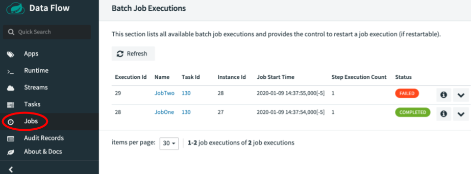

# Batch Job Restart

Spring Cloud Data Flow allows a user to restart a Spring Batch Job. Meaning that if a Spring Batch Job fails, it can be restarted and pick up the work from where it left off. In this section, we will show you how you can restart batch jobs using Spring Cloud Data Flow.

## Restarting a Batch Job

To restart a Spring Batch Job, navigate to the Jobs page by pressing the `Jobs` tab located on the left hand side of the UI.

Now identify the job you wish to restart. In our example below, the `JobTwo` job shows a status of `FAILED`, thus this is the job that should be restarted.
To do this press the dropdown button associated with the `JobTwo` job and select `Restart the job`.

Now a dialog box will appear asking if you wish to restart the job. Press the `Restart` button.

At this point Spring Cloud Data Flow will relaunch the task for this Spring Batch Job.
Once the Job has finished you will see that `JobTwo` completed successfully.

