# What is a composed task?

A composed task is a directed graph where each node of the graph is a task application.
Spring Cloud Data Flow lets a user create a composed task via a browser based UI, shell, or RESTful API.
In this section, we will show you how you can create and manage composed tasks.

## Composed Task 101

Before going into how create and manage composed tasks. Let's discuss a scenario where we want to launch a sequence of task definitions.  
For this discussion lets say we want to launch task definitions `task-a`, `task-b`, and `task-c`.
For example we launch task definition `task-a` and if `task-a` has completed successfully then we want to launch task definition `task-b`. Once `task-b` has completed successfully we want to launch task definition `task-c`. In this case the graph would look like:


The diagram above can be expressed using Spring Cloud Data Flow's task definition DSL as shown below:

```
task-a && task-b && task-c
```

The `&&` in the DSL above states that the task definition to the left of the `&&` must complete successfully before the next task definition in the flow can be launched.

Once the composed task definition above is created, it can be launched in the same way a regular task definition is launched. Behind the scenes, Spring Cloud Data Flow will launch the `Composed Task Runner` application to manage the execution of the composed task graph.
It does this by parsing the Spring Cloud Data Flow task definition DSL provided, and then makes RESTful API calls back to the Spring Cloud Data Flow server to launch the tasks definition. As each task completes, it will launch the next appropriate task definition.
In the following segments, you will create your own composed task graphs to explore the various ways you can create a composed task flow.

# Configuring Spring Cloud Data Flow Launch Composed Tasks

As discussed earlier the `Composed-Task-Runner` is an application that manages the execution of the tasks in a composed task graph. So before creating composed tasks we need to configure Spring Cloud Data Flow to launch the Composed Task Runner properly.

## Configuring Data Flow to launch the Composed Task Runner

When launching a composed task Spring Cloud Data Flow passes properties to the `Composed-Task-Runner` so that it can execute the directed graph properly. To do this you must configure Spring Cloud Data Flow's `dataflow.server.uri` property in order for the `Composed Task Runner` can make the RESTful API calls to the correct SCDF Server:

- dataflow.server.uri - Is the URI of the Spring Cloud Data Flow Server that will be used by the `Composed Task Runner` to execute its RESTful API calls. It defaults to https://localhost:9393.
- spring.cloud.dataflow.task.composed.task.runner.uri - Establishes where Spring Cloud Data Flow will obtain the `Composed Task Runner` artifact. By default Spring Cloud Data Flow will retrieve the artifact from Maven Central for the `local` and `Cloud Foundry` platforms. For `Kubernetes` it will obtain the artifact from DockerHub.
- maximumConcurrentTasks - Spring Cloud Data Flow allows a user to limit the maximum number of concurrently running tasks for each configured platform to prevent the saturation of IaaS/hardware resources.
  The limit is set to `20` for all supported platforms by default. If the number of concurrently running tasks on a platform instance is greater or equal to the limit, the next task launch request will fail and an error message will be returned via the RESTful API, Shell or UI.
  This limit can be configured for a platform instance by setting the corresponding deployer property to the number maximum number of concurrent tasks:
  ```
  spring.cloud.dataflow.task.platform.<platform-type>.accounts[<account-name>].deployment.maximumConcurrentTasks`
  ```
  The `<account-name>` is the name of a configured platform account (`default` if no accounts are explicitly configured).
  The `<platform-type>` refers to one of the currently supported deployers: `local`, `cloudfoundry`, or `kubernetes`.

[[note]]
| Changing this property will require Spring Cloud Data Flow to be restarted.

## Registering Applications

### Registering sample apps

Before working the composed task samples below, the sample applications that are used in the examples must be registered first.
So for this guide we will re-register the timestamp application multiple times using the names: `task-a`, `task-b`, `task-c`, `task-d`, `task-e`, and `task-f`.

<!--TABS-->

<!--Local-->

Spring Cloud Data Flow supports Maven, HTTP, file, and Docker resources for local deployments. For local, we use the Maven resource.
The URI for a Maven artifact is generally of the form `maven://<groupId>:<artifactId>:<version>`. The maven URI for the sample application is as follows:

```
maven://org.springframework.cloud.task.app:timestamp-task:2.1.0.RELEASE
```

The `maven:` protocol specifies a Maven artifact, which is resolved by using the remote and local Maven repositories configured for the Data Flow server.
To register an application, select `Add Applications` and `Register one or more applications`. For `task-a` fill in the form, as shown in the following image, and click `Register the application(s)`.


Repeat this registration for `task-a`, `task-b`, `task-c`, `task-d`, `task-e`, and `task-f` while using the same URI: `maven://org.springframework.cloud.task.app:timestamp-task:2.1.0.RELEASE`.

<!--CloudFoundry-->

Spring Cloud Data Flow supports Maven, HTTP, and Docker resources for local deployments. For Cloud Foundry, we use an HTTP (actually, HTTPS) resource. The URI for an HTTPS resource is of the form `https://<web-path>/<artifactName>-<version>.jar`. Spring Cloud Data Flow then pulls the artifact from the HTTPS URI.

The HTTPS URI for the sample app is as follows:

```
https://repo.spring.io/libs-snapshot/org/springframework/cloud/task/app/timestamp-task/2.1.0.RELEASE/timestamp-task-2.1.0.RELEASE.jar
```

To register an application, select `Add Applications` and `Register one or more applications`. Fill in the form, as shown in the following image, and click `Register the application(s)`.


Repeat this registration for `task-a`, `task-b`, `task-c`, `task-d`, `task-e`, and `task-f` while using the same URI:

```
https://repo.spring.io/libs-snapshot/org/springframework/cloud/task/app/timestamp-task/2.1.0.RELEASE/timestamp-task-2.1.0.RELEASE.jar`
```

<!--Kubernetes-->

Spring Cloud Data Flow supports Docker resources for Kubernetes deployments.
The URI for a Docker image is of the form `docker:<docker-image-path>/<imageName>:<version>` and is resolved by using the Docker registry configured for the Data Flow task platform and image pull policy.

The Docker URI for the sample app is as follows:

```
docker:springcloudtask/timestamp-task:2.1.0.RELEASE
```

To register an application, select `Add Applications` and `Register one or more applications`. Fill in the form, as shown in the following image, and click `Register the application(s)`.

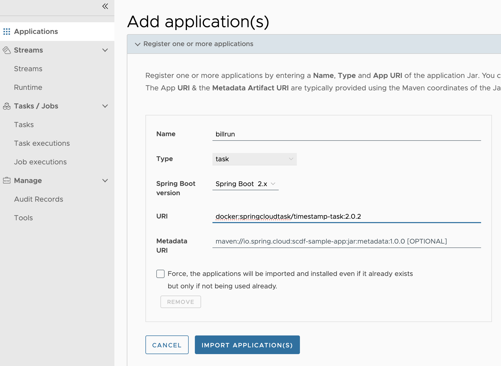

Repeat this registration for `task-a`, `task-b`, `task-c`, `task-d`, `task-e`, and `task-f` while using the same URI: `docker:springcloudtask/timestamp-task:2.1.0.RELEASE`.

<!--END_TABS-->

[[note]]
| If Maven Central or DockerHub cannot be reached for a given Spring Cloud Data Flow
| deployment a different URI can be specified to retrieve the Composed Task Runner using the
| `spring.cloud.dataflow.task.composed.task.runner.uri` property.

## The Transition Sample Project

In order for us to explore some of the flows that are available via a composed task diagram, we need an application
that allows us to configure its exit status at startup time. This `transition-sample` gives us the ability to explore various flows through a composed task diagram.

### Getting the Transition Sample Project from Github

From a console lets pull the project from github.

1. Choose a working directory where you want to clone the project.
2. From the working directory execute the following git command:
   ```
   git clone https://github.com/spring-cloud/spring-cloud-dataflow-samples.git
   ```
3. Now go into the spring-cloud-dataflow-samples/transition-sample directory
   ```
   cd spring-cloud-dataflow-samples/transition-sample
   ```

### Building the Transition Sample Project

To build the application execute the following command:

```
./mvnw clean install
```

To build the docker image use the following command:

```
./mvnw dockerfile:build
```

### Registering the Transition Sample

<!--TABS-->

<!--Local-->

Spring Cloud Data Flow supports Maven, HTTP, file, and Docker resources for local deployments. For this example, we use the Maven resource.
The URI for a Maven artifact is generally of the form `maven://<groupId>:<artifactId>:<version>`. The maven URI for the sample application is as follows:

```
maven://io.spring:transition-sample:1.0.0.BUILD-SNAPSHOT
```

The `maven:` protocol specifies a Maven artifact, which is resolved by using the remote and local Maven repositories configured for the Data Flow server.
To register an application, select `Add Applications` and `Register one or more applications`. Fill in the form, as shown in the following image, and click `Register the application(s)`.

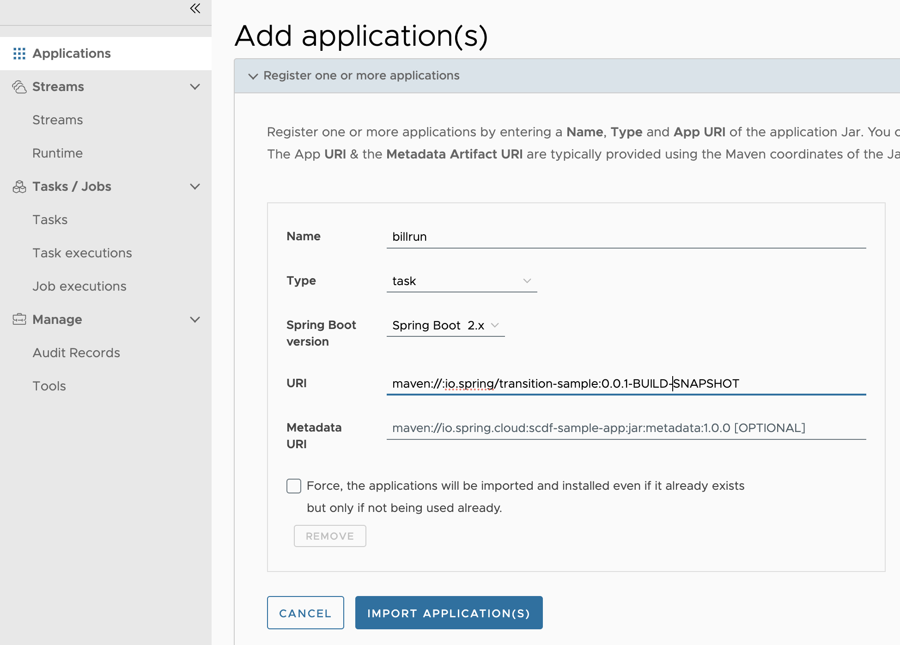

<!--CloudFoundry-->

Spring Cloud Data Flow supports Maven, HTTP, and Docker resources for local deployments. For this example, we use an HTTP (actually, HTTPS) resource. The URI for an HTTPS resource is of the form `https://<web-path>/<artifactName>-<version>.jar`. Spring Cloud Data Flow then pulls the artifact from the HTTPS URI.

The HTTPS URI for the sample app is as follows:

```
http://<path to your jar>:transition-sample:1.0.0.BUILD-SNAPSHOT
```

To register an application, select `Add Applications` and `Register one or more applications`. Fill in the form, as shown in the following image, and click `Register the application(s)`.

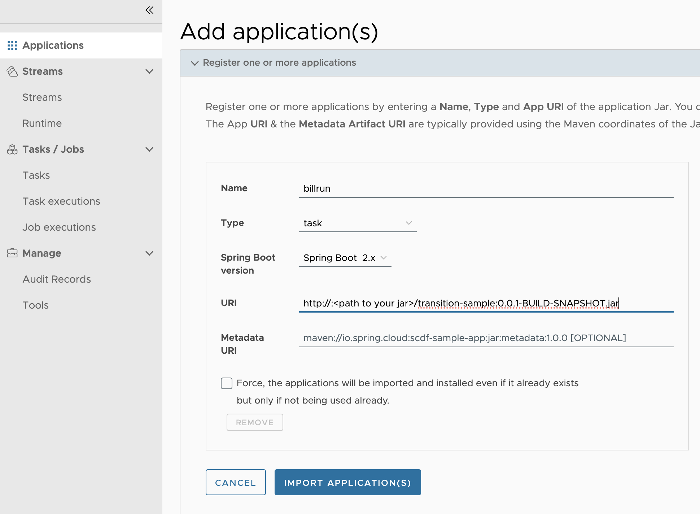

<!--Kubernetes-->

Spring Cloud Data Flow supports Docker resources for Kubernetes deployments.
The URI for a Docker image is of the form `docker:<docker-image-path>/<imageName>:<version>` and is resolved by using the Docker registry configured for the Data Flow task platform and image pull policy.

The Docker URI for the sample app is as follows:

```
docker:springcloud/transition-sample:latest
```

To register an application, select `Add Applications` and `Register one or more applications`. Fill in the form, as shown in the following image, and click `Register the application(s)`.

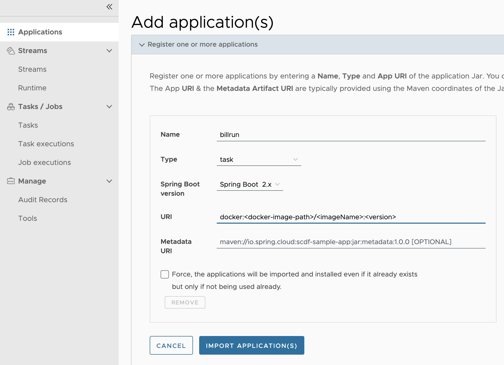

<!--END_TABS-->

#Building a Composed Task
In this segment you will have a chance to explore the 3 foundation structures supported by Spring Cloud Data Flow.

## Conditional Execution

Conditional execution is expressed by using a double ampersand symbol `&&`. This lets each task in the sequence be launched only if the previous task successfully completed.

### Create Conditional Execution Composed Task Definition

To create your conditional execution using the Spring Cloud Data Flow UI, press the `Tasks` tab on the left hand side of the dashboard and then press the `Create Task(s)` button at the top of the page.
Now copy the expression below and paste it in the text box located at the top of the page:

```
task-a && task-b
```

You will see the graph appear in the dashboard as shown below:
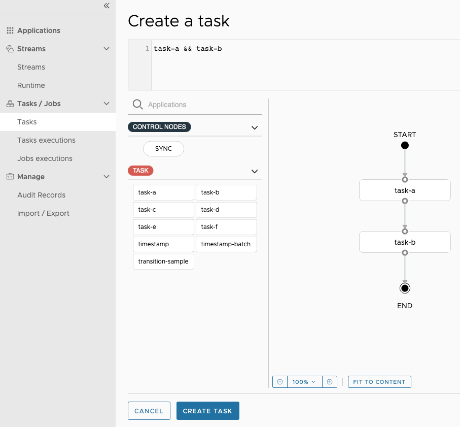

[[note]]
| In the example above you will note that we used labels `timestamp-1` and `timestamp-2`, this is necessary since we are using 2 timestamp applications in the same graph.  
Now press the `Create Task` button at the bottom of the page. Now a dialog will appear requesting you to `Confirm Task Creation`. To do this enter `conditional-execution` as the composed task name in the `Name` field and press the `Create the task` button as shown below:


Now the Task Definition page will be displayed and you will see that 3 task definitions were created as shown below:


1. The `conditional-execution` task definition is the `Composed-Task-Runner` application that will manage the execution of the directed-graph.
1. The `conditional-execution-timestamp-1` is the task definition that represents the `timestamp-1` app defined in the DSL you entered above.
1. The `conditional-execution-timestamp-2` is the task definition that represents the `timestamp-2` app defined in the DSL you entered above.

### Launch Conditional Execution Composed Task Definition

To launch the composed task, press the play button of the task definition named `conditional-execution` as shown below:

Now the task launch page will appear. Since we are using app defaults, we just need to press the `Launch the task` button as shown below:
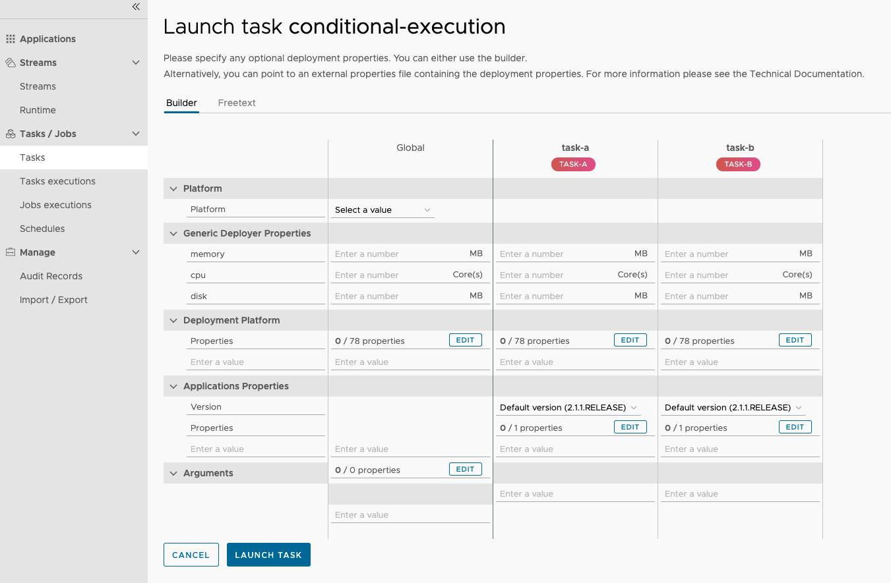
When the composed task called `conditional-execution` task definition is launched, it launches the task called timestamp-1 and, if it completes successfully, then the task called timestamp-2 is launched. If timestamp-1 fails, then timestamp-2 does not launch.

### Check the status of the Conditional Execution Composed Task Definition

Now that we have executed the `conditional-execution` task definition, we can check the task execution status.
This can be done by clicking the `Executions` tab on top of the `Tasks` page. From here we can see that the `conditional-execution` (`Composed-Task-Runner`) successfully launched each of the child apps(`timestamp-1` and `timestamp-2`) as shown below:


## Transitional Execution

Transitions allow users to specify the branch of a tree they want the flow to follow. A task transition is represented by the following symbol `->`. So lets create a basic transition graph.

### Create Basic Transition Task Definition

To create your basic transition using the Spring Cloud Data Flow UI, press the `Tasks` tab on the left hand side of the dashboard and then press the `Create Task(s)` button at the top of the page.
Now copy the expression below and paste it in the text box located at the top of the page:

```
transition-sample 'FAILED' -> task-a 'COMPLETED' -> task-b
```

It should look like the following:
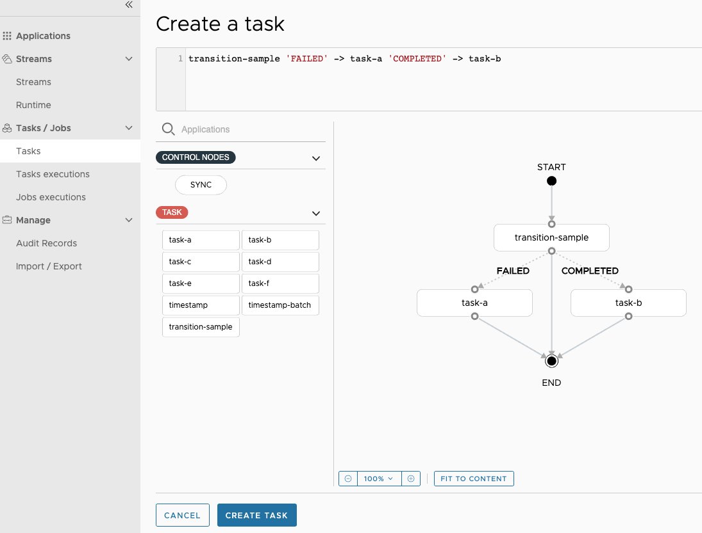
[[note]]
| You can use Spring Cloud Data Flow UI's drag and drop capabilities to draw the graph vs. using the DSL.

Now that the graph is rendered as shown above, its time to dig into the details.
The first application to be launched will be the `transition-sample`. Since transition-sample is a Spring Cloud Task application, Spring Cloud Task will record the exit message to the database at the end of the execution. This message will have one of the following values:

- COMPLETED - Meaning the task completed successfully.
- FAILED - Meaning the task failed during its execution.
- Custom Exit Message - A Spring Cloud Task application can return a custom exit message as discussed [here](https://docs.spring.io/spring-cloud-task/docs/current/reference/index.html#features-task-execution-listener-exit-messages).

Once the `transition-sample`'s execution is complete, the composed task runner will check the exit message for `transition-sample` and then evaluate which of the paths it should take. In our case its has two paths (as denoted by the `->` operator).

- FAILED - If `transition-sample` returns `FAILED` then the `timestamp` app labeled `timestamp-1` will be executed.
- COMPLETED - If `transition-sample` returns `COMPLETED` then the `timestamp` app labeled `timestamp-2` will be executed.

Now press the `Create Task` button at the bottom of the page. Now a dialog will appear requesting you to `Confirm Task Creation`. To do this enter `basictransition` as the composed task name in the `Name` field and press the `Create the task` button as shown below:
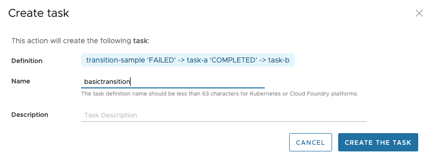

### Launch the Composed Task Definition

Now let’s launch our composed task a couple of times so that we can exercise its paths through the tree.

First let’s see what happens if we set the exit message to "FAILED"
To do this, select the `basictransition` `Composed Task Runner` to be executed as shown below:

Now from the task launch page lets populate page with the following:
Arguments:

```
--increment-instance-enabled=true
--interval-time-between-checks=1000
```

Parameters:

```
app.basictransition.transition-sample.taskapp.exitMessage=FAILED
```

It should look like the following:


Now that it has been executed let’s verify that path FAILED was actually followed and this can be done by pressing the `Executions` tab at the top of the task page:


This shows us that the `Composed Task Runner` controlling the composed task execution basic-transition was launched and the transition-sample was launched. From there the proper FAILED branch was executed as denoted by basictransition-timestamp-1 was launched.

Now relaunch the `Composed Task Runner` and set the `taskapp.exitMessage` to `COMPLETED` to exercise the other branch. To do this select the `basictransition` to be executed as shown below:

Now from the task launch page lets populate page with the following:

Arguments:

```
--increment-instance-enabled=true
--interval-time-between-checks=1000
```

Parameters:

```
app.basictransition.transition-sample.taskapp.exitMessage=COMPLETED
```

It should look like the following:


Now that it has been executed let’s verify that path `COMPLETED` was actually followed and this can be done by pressing the `Executions` tab at the top of the task page:


####Task Arguments and Parameters

Wait a minute…​ What is all that stuff I put in the command line? So for this example we wanted to show how to use both command line args and properties. We used the arguments to establish the properties for the `Composed Task Runner`:

1. `--increment-instance-enabled=true` By default a composed task definition can only be executed once if it completes successfully. You are allowed to restart a failed composed task however. Spring Cloud Data Flow does allow a user to re-execute a composed task. This can be done by setting this property to `true`.
1. `--interval-time-between-checks=1000` states that the `Composed Task Runner` will wait 1 second between checks to make sure that a task is complete (the default is 10 seconds).

More can be read about the sections of a property and the different property types [here](#passing-properties)

#### Are there more states to a transition?

Now what happens if I were to enter "FOO" for the exit message what would happen? Well lets try it!

To do this, select the `basictransition` `Composed Task Runner` to be executed as shown below:

Now from the task launch page lets populate page with the following:
Arguments:

```
--increment-instance-enabled=true
--interval-time-between-checks=1000
```

SCDF-composed-task-transition-launch-foo-fail
Parameters:

```
app.basictransition.transition-sample.taskapp.exitMessage=FOO
```

It should look like the following:

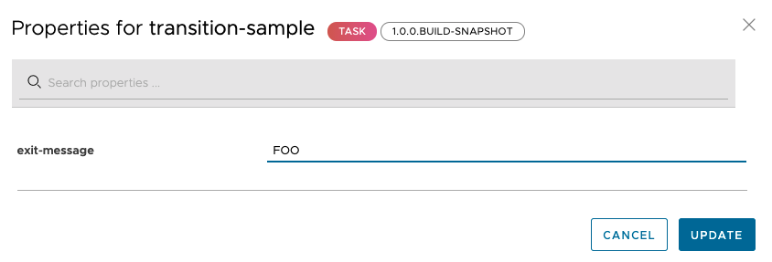

Now that it has been executed let’s verify that path `FOO` was actually followed and this can be done by pressing the `Executions` tab at the top of the task page:


In this case we see that the composed task ended with just running the `Composed Task Runner` and the transition sample. This was because FOO was not targeted. How would we handle that? i.e. have a path for COMPLETED, FAILED, and everything else?

In this case would want to create another composed task using a wild card that would look like:

To create your basic transition using the Spring Cloud Data Flow UI, press the `Tasks` tab on the left hand side of the dashboard and then press the `Create Task(s)` button at the top of the page.
Now copy the expression below and paste it in the text box located at the top of the page:

```
transition-sample 'FAILED' -> task-a 'COMPLETED' -> task-b '*' -> task-c
```

It should look like the following:
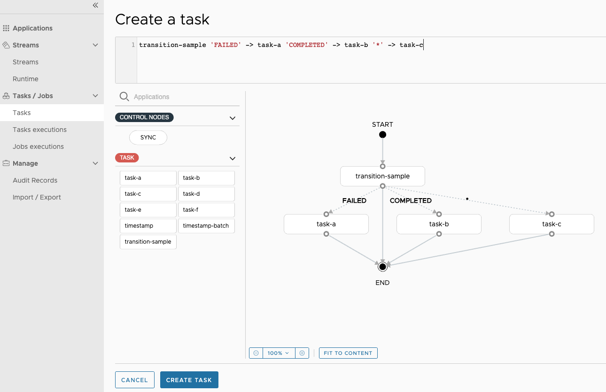
Now press the `Create Task` button at the bottom of the page. Now a dialog will appear requesting you to `Confirm Task Creation`. To do this enter `anothertransition` as the composed task name in the `Name` field and press the `Create the task` button as shown below:


To do this, select the `anothertransition` `Composed Task Runner` to be executed as shown below:

Now from the task launch page populate page with the following:
Arguments:

```
--increment-instance-enabled=true
--interval-time-between-checks=1000
```

Parameters:

```
app.anothertransition.transition-sample.taskapp.exitMessage=FOO
```

It should look like the following:


Launch the task and then verify that path `FOO` was actually followed and this can be done by pressing the `Executions` tab at the top of the task page:


In this case we see that the wildcard catches all other exit messages and this can be seen in that anothertransition-timestamp-3 was launched.

## Split Execution

What if we want to execute multiple tasks at the same time? The Composed Task DSL supports the concept of a split that will allow you to just that. The task definition DSL supports a concept of a split that will allow you to launch multiple task apps at the same time. Each split contains a list of tasks that are contained within the less than `<` and greater than `>` symbol and delimited by 2 pipe symbols `||`.  
For example, if I wanted to launch 3 tasks at the same time the DSL would look like:

```
<task-a || task-b || task-c>
```

Now create a composed task that contains both a split and a transition.  
To create your split graph sample using the Spring Cloud Data Flow UI, press the `Tasks` tab on the left-hand side of the dashboard and then press the `Create Task(s)` button at the top of the page.
Now copy the expression below and paste it in the text box located at the top of the page:

```
<task-a || task-b || task-c>  && transition-sample 'FAILED' -> task-d 'COMPLETED' -> task-e '*' -> task-f
```

It should look like the following:
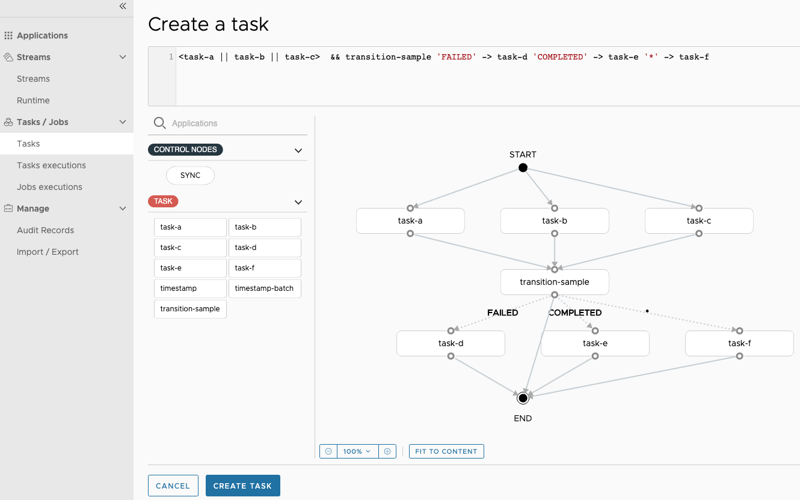
Now press the `Create Task` button at the bottom of the page. Now a dialog will appear requesting you to `Confirm Task Creation`. To do this enter `splitgraph` as the composed task name in the `Name` field and press the `Create the task` button as shown below:
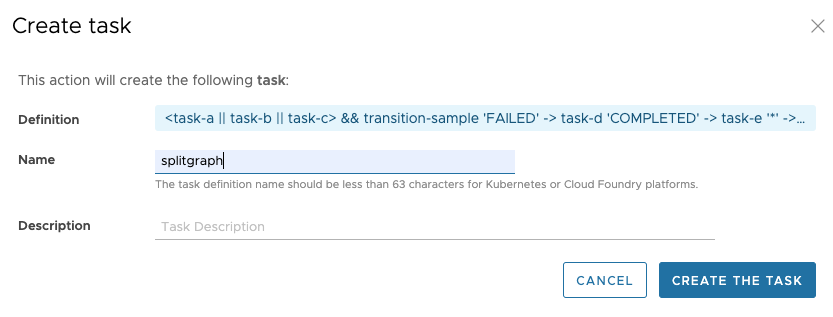

Select the `splitgraph` `Composed Task Runner` to be executed as shown below:

Now from the task launch page, populate the following fields:

Arguments:

```
--increment-instance-enabled=true
--interval-time-between-checks=1000
--split-thread-core-pool-size=4
--spring.cloud.task.closecontext-enabled=true
```

Parameters:

```
app.splitgraph.transition-sample.taskapp.exitMessage=FOO
```

It should look like the following:


Launch the task and then verify that all tasks were launched and that the path `FOO` was actually followed. This can be done by pressing the `Executions` tab at the top of the task page:


In this example we see that the split1-3 were fired simultaneously before CTR launched our transition app. And we added a new argument `--split-thread-core-pool-size=4` this basically states that the composed task runner can run 4 apps simultaneously.

### Arguments and Properties

Again, what is all that stuff I put in the command line? So for this example we wanted to show how to use both command line args and properties. We used the arguments to establish the properties for the `Composed Task Runner`:

1. `--increment-instance-enabled=true` states that we want to be able to execute this Composed Task multiple times. (Composed Tasks are build using Spring Batch and thus are batch jobs)
1. `--interval-time-between-checks=1000` states that the `Composed Task Runner` will wait 1 second between checks to make sure that a task is complete (the default is 10 seconds).
1. `--split-thread-core-pool-size=4` states that we want up to 4 simulatenous tasks to run at the same time.
1. `--spring.cloud.task.closecontext-enabled=true` states that we want the Spring Context to close when the `Composed Task Runner`.

[[note]]
| When using `split` you must set the `spring.cloud.task.closecontext-enabled` property as shown above.

### Configuring your split

In the example above we configured the behavior of our split in the composed task by using the `spring.cloud.task.closecontext-enabled` and `split-thread-core-pool-size` properties. Let's look at all the properties you can take advantage of when using splits.

- spring.cloud.task.closecontext-enabled - When using splits, this property is required to be set to `true` because the context will not close, because threads were allocated to support the split.
- split-thread-core-pool-size - Establishes the initial number of threads required for the splits in the composed task. Each task app contained in a split requires a thread in order to execute. (Defaults to 1)
- split-thread-max-pool-size - The maximum number threads to be allocated.
- split-thread-queue-capacity - The number of tasks that should be enqueued if all threads are in use before a new thread is allocated.

### Basic Split Sizing

The simplest configuration for splits is to set the `split-thread-core-pool-size` property. You want to look at your graph and count the split that has the largest number of task apps,
this will be the number of threads you will need to utilize. To set the thread count use the split-thread-core-pool-size property (defaults to 1).
So for example a definition like: <AAA || BBB || CCC> && <DDD || EEE> would require a split-thread-core-pool-size of 3.
This is because the largest split contains 3 task apps. A count of 2 would mean that AAA and BBB would run in parallel but CCC would wait until either AAA or BBB to finish. Then DDD and EEE would run in parallel.

## Restarting Composed Task Runner when task app fails

Composed tasks in Spring Cloud Data Flow allow users to re-launch the failed composed task in cases where a task app fails.
A task app is considered failed when the application returns a non-zero `exitCode`. In the following example we have a simple conditional execution composed task:

```
task-a && task-b && task-c
```

Assume we have created a composed task named `my-composed-task` now we want to launch it using the UI:

1. Launch it by pressing the `play` button shown below:
   
1. When the launch page appears press the `Launch the task` button.
1. Once `my-composed-task` has completed executing we can see that `task-b` was marked `ERROR`, meaning the application returned a non-zero `exitCode`. We can verify this by clicking the `Executions` tab at the top of the page and viewing the task executions. Note that `my-composed-task-task-b` has been marked with exit code of `1`. This means that this is the task app returned a non zero exit code, that stopped the composed task execution.  
    
   Once we have resolved the problem that caused the failure we can restart `my-composed-task` and the composed task runner will identify the task app that failed and re-run it and then continue executing the DSL from that point.

1. Press the `Jobs` tab located on the left side of the page.
1. Now press the dropdown button by the failed `my-composed-task` and select `Restart the job` as shown below:
   
1. Once the composed task completes we will see a new job for my-composed-task present that shows status of completed.
   
1. Now press the `Tasks` tab to the left of the page and then when the Task Definition page appears press the `Executions` tab at the top. Notice that you have 2 `Composed Task Runs` the first is the failed composed task execution where `task-b` failed. But then on the second execution we see that `my-composed-task` `Composed Task Runner` started the graph at the failed task app (`task-b`) and completed the composed task as shown below:
   

# Passing Properties

Spring Cloud Data Flow allows users to pass both application and deployment properties to `Composed Task Runner` and to the task apps in the graph.

## Passing properties to tasks in the graph

Setting properties for a task in the graph can be done in two ways:

1. Setting the property in the task definition.
2. Setting the property at composed task launch time.

### Setting property in the task definition

A property can be set when a composed task definition is being written. This is done by adding adding the `--` token followed by the property to the right of the task application name in the composed task definition. For example:

```
task-a --myproperty=value1 --anotherproperty=value2 && task-b --mybproperty=value3
```

In the example above `task-a` has 2 properties set as well as `task-b` has a property set to the values required.

### Setting property at composed task launch time

There are 4 components that make up the property:

- Property Type - This tells Spring Cloud Data Flow if the property is either a `deployment` or a `app` type.
  - Deployment properties - are instructions to the deployer responsible for deploying the task app.
  - App properties - are properties passed directly the task app.
- Composed Task Definition Name
- Task App Name - The label or the name of the application to which the property should be applied.
- Property Key - The key of the property that is to be set.

To set a property `myproperty` for task app named `task-a` in a composed task named `my-composed-task` for the following dsl:

```
task-a && task-b
```

It would look something like this:


Similarly if I wanted to pass a deployer property the format would remain the same except the the property type would `deployer`, for example we need to set the `kubernetes.limits.cpu` for `task-a`:

```
    deployer.my-composed-task.task-a.kubernetes.limits.cpu=1000m
```

Launching a composed task and setting both `app` and `deployer` properties would be done in the following way using the UI:

1. Launch composed task as shown below by pressing the `play` button next to the composed task definition that needs to be launched:
   
1. Set the properties as follows in the `Parameters` text box:
   
1. Now press the `Launch the task` button.

[[note]]
|Properties set at launch time have a higher precedence than those set at task definition. For example, if property `myproperty` has been set in the composed task definition and at launch time, the value set at launch time will be used.

## Passing Properties to Composed Task Runner

There are 3 components that make up the property:

- Property Type - This tells Spring Cloud Data Flow if the property is either a `deployment` or a `app` type.
  - Deployment properties - are instructions to the deployer responsible for deploying the task app.
  - App properties - are properties passed directly the task app.
- Composed Task Application Name - Unlike when passing properties to a task app where we used the composed task definition name we will use the name of the composed task runner app.
- Property Key - The key of the property that is to be set.

To launch a composed task where we want to pass the following properties to the `Composed Task Runner`:

- `increment-instance-enabled` - an `app` property that allows a single `Composed Task Runner` instance to be re-executed without changing the parameters.
- `kubernetes.limits.cpu` - a `deployer` property that sets the Kubernetes cpu limit for the composed task runner
  Launching a composed task and setting both `app` and `deployer` properties for the `Composed Task Runner` would be done in the following way using the UI:

1. Launch composed task as shown below by pressing the `play` button next to the composed task definition that needs to be launched:
   
1. Set the properties as follows in the `Parameters` text box:
   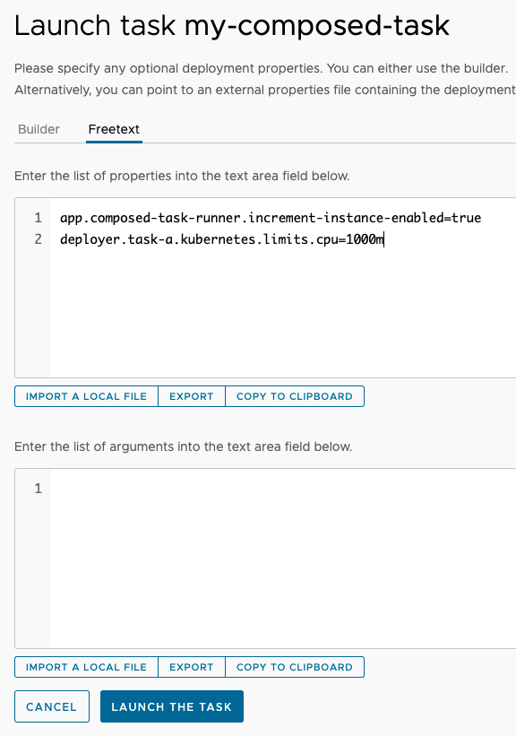
1. Now press the `Launch the task` button.

## Launching Composed Task using RESTful API

In this section we will provide an example on how to create and launch a composed-task.

For this example we want to create a composed task `my-composed-task` with the following composed task definition:

```
task-a && task-b
```

Using `curl` the command would look like:

```shell script
curl 'http://localhost:9393/tasks/definitions' --data-urlencode "name=my-composed-task" --data-urlencode "definition=task-a && task-b"
```

The response from the Spring Cloud Data Flow Server will look something like:

```http request
HTTP/1.1 200
Content-Type: application/hal+json
Transfer-Encoding: chunked
Date: Fri, 17 Jan 2020 16:19:04 GMT

{"name":"my-composed-task","dslText":"task-a && task-b","description":"","composed":true,"lastTaskExecution":null,"status":"UNKNOWN","_links":{"self":{"href":"http://localhost:9393/tasks/definitions/my-composed-task"}}}
```

To verify that the `my-composed-task` composed task was created we will execute a curl list.

```shell script
curl 'http://localhost:9393/tasks/definitions?page=0&size=10&sort=taskName' -i -X GET
```

The response from the Spring Cloud Data Flow Server will look something like:

```http request
HTTP/1.1 200
Content-Type: application/hal+json
Transfer-Encoding: chunked
Date: Fri, 17 Jan 2020 16:24:39 GMT

{"_embedded":{"taskDefinitionResourceList":[{"name":"my-composed-task","dslText":"task-a && task-b","description":"","composed":true,"lastTaskExecution":null,"status":"UNKNOWN","_links":{"self":{"href":"http://localhost:9393/tasks/definitions/my-composed-task"}}},{"name":"my-composed-task-task-a","dslText":"task-a","description":null,"composed":false,"lastTaskExecution":null,"status":"UNKNOWN","_links":{"self":{"href":"http://localhost:9393/tasks/definitions/my-composed-task-task-a"}}},{"name":"my-composed-task-task-b","dslText":"task-b","description":null,"composed":false,"lastTaskExecution":null,"status":"UNKNOWN","_links":{"self":{"href":"http://localhost:9393/tasks/definitions/my-composed-task-task-b"}}}]},"_links":{"self":{"href":"http://localhost:9393/tasks/definitions?page=0&size=10&sort=taskName,asc"}},"page":{"size":10,"totalElements":3,"totalPages":1,"number":0}}
```

To launch `my-composed-task` with the following properties for task-a

- `app.my-composed-task.task-a.my-prop=good`
- `app.my-composed-task.task-b.my-prop=great`

```shell script
curl 'http://localhost:9393/tasks/executions' -i -X POST -d 'name=my-composed-task&properties=app.my-composed-task.task-a.my-prop=good,%20app.my-composed-task.task-b.my-prop=great'
```

The response from the Spring Cloud Data Flow Server will look something like:

```http request
HTTP/1.1 201
Content-Type: application/json
Transfer-Encoding: chunked
Date: Fri, 17 Jan 2020 16:33:06 GMT
```

To verify that the `my-composed-task` composed task was executed we will execute a curl list.

```shell script
curl 'http://localhost:9393/tasks/executions?page=0&size=10' -i -X GET
```

The response from the Spring Cloud Data Flow Server will look something like:

````http request
HTTP/1.1 200
Content-Type: application/hal+json
Transfer-Encoding: chunked
Date: Fri, 17 Jan 2020 16:35:42 GMT

{"_embedded":{"taskExecutionResourceList":[{"executionId":285,"exitCode":0,"taskName":"my-composed-task-task-b","startTime":"2020-01-17T11:33:24.000-0500","endTime":"2020-01-17T11:33:25.000-0500","exitMessage":null,"arguments":["--spring.cloud.task.parent-execution-id=283","--spring.cloud.data.flow.platformname=default","--spring.cloud.task.executionid=285"],"jobExecutionIds":[],"errorMessage":null,"externalExecutionId":"my-composed-task-task-b-217b8de4-8877-4350-8cc7-001a4347d3b5","parentExecutionId":283,"resourceUrl":"URL [file:////Users/glennrenfro/project/spring-cloud-dataflow-samples/pauseasec/target/pauseasec-1.0.0.BUILD-SNAPSHOT.jar]","appProperties":{"spring.datasource.username":"******","my-prop":"great","spring.datasource.url":"******","spring.datasource.driverClassName":"org.mariadb.jdbc.Driver","spring.cloud.task.name":"my-composed-task-task-b","spring.datasource.password":"******"},"deploymentProperties":{"app.task-b.my-prop":"great"},"taskExecutionStatus":"COMPLETE","_links":{"self":{"href":"http://localhost:9393/tasks/executions/285"}}},{"executionId":284,"exitCode":0,"taskName":"my-composed-task-task-a","startTime":"2020-01-17T11:33:15.000-0500","endTime":"2020-01-17T11:33:15.000-0500","exitMessage":null,"arguments":["--spring.cloud.task.parent-execution-id=283","--spring.cloud.data.flow.platformname=default","--spring.cloud.task.executionid=284"],"jobExecutionIds":[],"errorMessage":null,"externalExecutionId":"my-composed-task-task-a-0806d01f-b08a-4db5-a4d2-ab819e9df5df","parentExecutionId":283,"resourceUrl":"org.springframework.cloud.task.app:timestamp-task:jar:2.1.0.RELEASE","appProperties":{"spring.datasource.username":"******","my-prop":"good","spring.datasource.url":"******","spring.datasource.driverClassName":"org.mariadb.jdbc.Driver","spring.cloud.task.name":"my-composed-task-task-a","spring.datasource.password":"******"},"deploymentProperties":{"app.task-a.my-prop":"good"},"taskExecutionStatus":"COMPLETE","_links":{"self":{"href":"http://localhost:9393/tasks/executions/284"}}},{"executionId":283,"exitCode":0,"taskName":"my-composed-task","startTime":"2020-01-17T11:33:12.000-0500","endTime":"2020-01-17T11:33:33.000-0500","exitMessage":null,"arguments":["--spring.cloud.data.flow.platformname=default","--spring.cloud.task.executionid=283","--spring.cloud.data.flow.taskappname=composed-task-runner"],"jobExecutionIds":[75],"errorMessage":null,"externalExecutionId":"my-composed-task-7a2ad551-a81c-46bf-9661-f9d5f78b27c4","parentExecutionId":null,"resourceUrl":"URL [file:////Users/glennrenfro/project/spring-cloud-task-app-starters/composed-task-runner/apps/composedtaskrunner-task/target/composedtaskrunner-task-2.1.3.BUILD-SNAPSHOT.jar]","appProperties":{"spring.datasource.username":"******","spring.datasource.url":"******","spring.datasource.driverClassName":"org.mariadb.jdbc.Driver","spring.cloud.task.name":"my-composed-task","composed-task-properties":"app.my-composed-task-task-a.app.task-a.my-prop=good, app.my-composed-task-task-b.app.task-b.my-prop=great","graph":"my-composed-task-task-a && my-composed-task-task-b","spring.datasource.password":"******"},"deploymentProperties":{"app.composed-task-runner.composed-task-properties":"app.my-composed-task-task-a.app.task-a.my-prop=good, app.my-composed-task-task-b.app.task-b.my-prop=great"},"taskExecutionStatus":"COMPLETE","_links":{"self":{"href":"http://localhost:9393/tasks/executions/283"}}}]},"_links":{"self":{"href":"http://localhost:9393/tasks/executions?page=0&size=10"}},"page":{"size":10,"totalElements":3,"totalPages":1,"number":0}}```
````

# Configuring Composed Task Runner

## Launching a Composed Task When Security is Enabled

As a user you have three options to launch a composed task when Spring Cloud Data Flow authentication is enabled:

1. Basic authentication - Authentication using username and password
1. User configured access token - When launching a composed task provide the token you wish to use at launch time using the `dataflow-server-access-token` property.
1. Data Flow provided user token - If the `dataflow-server-use-user-access-token` property is set to `true`, Spring Cloud Data Flow will auto-populate the property `dataflow-server-access-token` with access token of the current logged in user.

### Basic Authentication

In the example below we will launch a composed task where the user provides the username and password.

1. Launch composed task as shown below by pressing the `play` button next to the composed task definition that needs to be launched:
   
1. Set the `dataflow-server-username` and `dataflow-server-password` as follows in the `Parameters` text box:
   
1. Now press the `Launch the task` button to launch the composed task.

### Using your own access token

In the case the composed task needs to be launched with a specific access token then pass the token using the `dataflow-server-access-token` property.

1. Launch composed task as shown below by pressing the `play` button next to the composed task definition that needs to be launched:
   
1. Set the `dataflow-server-access-token` as follows in the `Parameters` text box:
   
1. Now press the `Launch the task` button to launch the composed task.

### User Access Token

In the example below we will launch a composed task where the `dataflow-server-use-user-access-token` is set to `true`.

1. Launch composed task as shown below by pressing the `play` button next to the composed task definition that needs to be launched:
   
1. Set the `dataflow-server-use-user-access-token` as follows in the `Arguments` text box:
   
1. Now press the `Launch the task` button to launch the composed task.

## Configure URI for Composed Tasks

When a user launches a composed task, Spring Cloud Data Flow launches the `Composed Task Runner`
application to manage the execution of the composed task graph.
It does this by parsing the Spring Cloud Data Flow task definition DSL provided,
and then makes RESTful API calls back to the Spring Cloud Data Flow server to
launch the task definitions. As each task completes, it will launch the next
appropriate task definition. In order to set the URI that `Composed Task Runner`
will use to make is RESTful API calls, you will need to set the `SPRING_CLOUD_DATAFLOW_SERVER_URI`
property in Spring Cloud Data Flow server. Examples are shown below:

- Kubernetes spec for Spring Cloud Data Flow Server

```yaml
apiVersion: apps/v1
kind: Deployment
metadata:
  ...
spec:
  ...
  template:
    ...
    spec:
      containers:
        env:
        ...
        - name: SPRING_CLOUD_DATAFLOW_SERVER_URI
          value: '<URI to your SCDF Server>'
        ...
```

- Cloud Foundry Manifest For the Spring Cloud Data Flow Server

```yaml
---
applications:
  ...
  env:
    ...
    SPRING_CLOUD_DATAFLOW_SERVER_URI: <URI to your SCDF Server>
  services:
    ...
```
